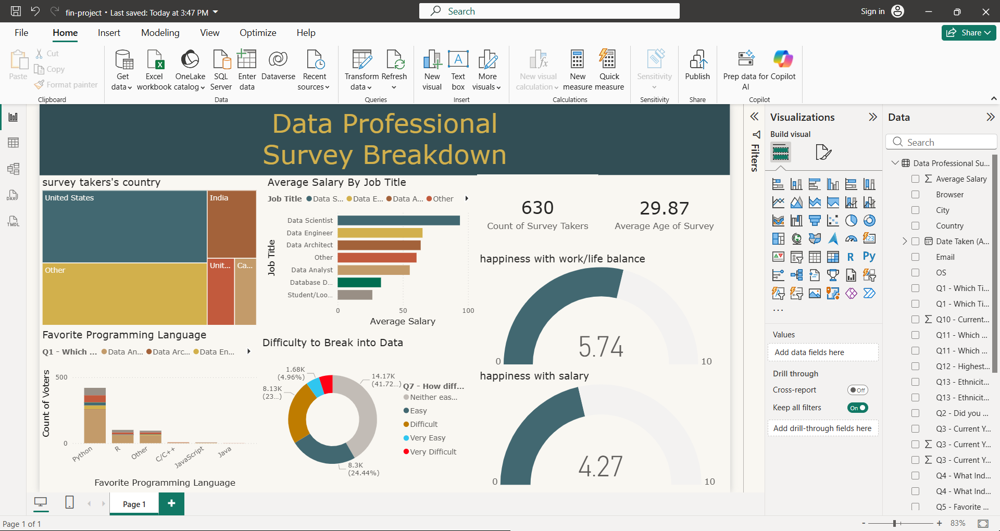

# Data-Professionals-Analysis
An interactive Power BI dashboard analyzing global data professional survey results, featuring insights on salary trends, job satisfaction, and popular programming languages.
# Data Professional Survey Breakdown - Power BI Dashboard

## 📌 Project Overview
This project features an interactive **Power BI Dashboard** that analyzes global survey data from data professionals. The goal is to provide a comprehensive look at the state of the data industry, including salary trends, popular technologies, and workplace satisfaction.

## 🛠️ Tools & Technologies
- **Power BI Desktop**: Used for data cleaning, modeling, and visualization.
- **DAX (Data Analysis Expressions)**: Used to create custom measures for average age and satisfaction levels.
- **Data Source**: Data Professional Salary Survey.

## 📊 Key Features & Visuals
- **Demographics**: A treemap visualizing the distribution of survey participants by country (USA, India, UK, Canada, etc.).
- **Salary Analysis**: A bar chart comparing average salaries across different job titles such as Data Scientist, Data Engineer, and Data Analyst.
- **Skillset Trends**: A column chart highlighting the favorite programming languages, with **Python** clearly leading the pack.
- **Workplace Satisfaction**: Gauge charts measuring:
  - Happiness with Work/Life Balance (Average: 5.74/10)
  - Happiness with Salary (Average: 4.27/10)
- **Career Entry**: A donut chart showing how difficult it is to break into the data field according to the participants.

## 🚀 Insights
- **The Python Dominance**: Python remains the most popular language among professionals, followed by R.
- **Salary Gap**: Data Scientists and Data Engineers tend to have higher average salaries compared to other roles.
- **Work-Life Balance**: There is a moderate level of satisfaction regarding work-life balance, while satisfaction with salary remains relatively low on average.

## 👤 Author
**[Mohammed Al-mokhtar]**
- LinkedIn: (https://www.linkedin.com/in/mohammed-al-mokhtar2001/)

---
*Feel free to star this repository if you find it helpful!*
